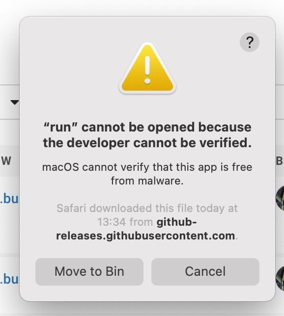

# Safari History Workflow

Search through Safari history with Alfred.

## Install

Download
[the latest release](https://github.com/kudrykv/alfred-safari-history/releases/tag/v0.1.0)
and double-click it.
Use `amd64` for Intel chips and `arm64` for M1 chips.
Alfred will proceed with the installation.

## Authorization

The first time you use the workflow after install or upgrade, you will see the security warning:

This is a quirk of MacOS 10.15 and above.
Apple currently forces developers to pay $99 per year to officially sign the executable and avoid the warning.

After seeing this warning, you have to go to
`System Preferences > Security & Privacy > General`
and click the new button that has appeared to allow the executable to run.
You then have to run it again, and you will see this security warning again, but now it will have a new button that lets you allow the executable to run.

# Usage

## Search

Run `h <query>` to look through the Safari history.

