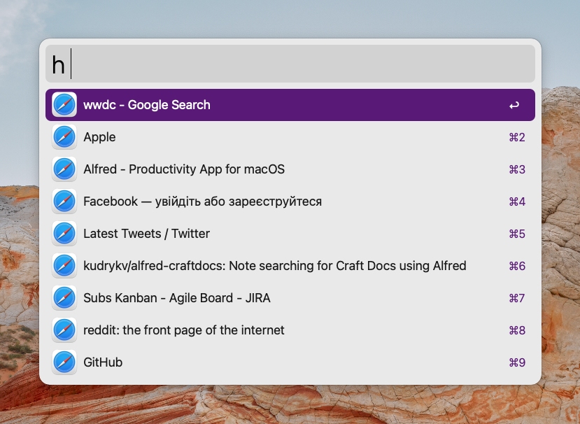
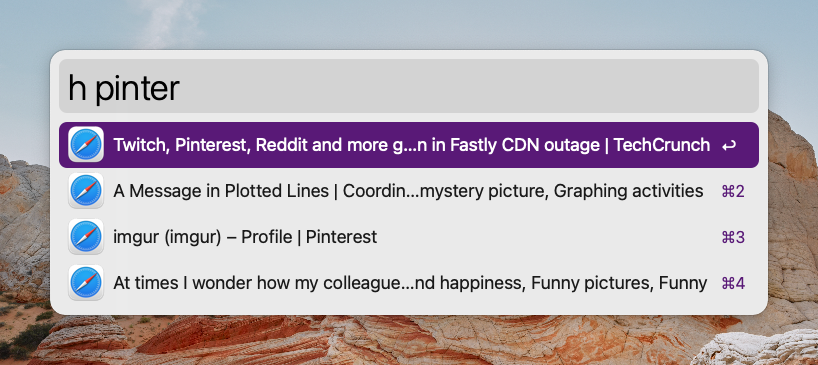

# Safari History Workflow

Search through Safari history with Alfred.

## Install

Download
[the latest release](https://github.com/kudrykv/alfred-safari-history/releases/tag/v0.1.1)
and double-click it.
Use `amd64` for Intel chips and `arm64` for M1 chips.
Alfred will proceed with the installation.

# Usage

## Search

Run `h <query>` to look through the Safari history.

